# Arquitectura del Sistema

## Visión General

Mi Tiendita Soft implementa una arquitectura modular que separa claramente la interfaz de usuario de la lógica de negocio, facilitando el mantenimiento y futuras expansiones del sistema.

## Principios Arquitectónicos

### Separación de Responsabilidades

- **UI (Frontend)**: Manejo de interfaz de usuario y experiencia
- **Business (Backend)**: Lógica de negocio y persistencia de datos
- **Data**: Almacenamiento en archivos Excel como base de datos local

### Modularidad

- Cada componente tiene una responsabilidad específica
- Bajo acoplamiento entre módulos
- Alta cohesión dentro de cada módulo

### Simplicidad

- Arquitectura sencilla apropiada para el alcance del MVP
- Tecnologías maduras y estables
- Configuración mínima requerida

## Estructura del Proyecto

```
mi-tiendita-soft/
├── main.py                          # Punto de entrada
├── src/
│   ├── ui/                         # 🎨 Frontend - Interfaz de Usuario
│   │   ├── home_view.py            # Vista principal de navegación
│   │   ├── stock_create_view.py    # Formulario de registro de productos
│   │   ├── stock_manage_view.py    # Consulta y gestión de inventario
│   │   ├── create_sell_view.py     # Interfaz para procesar ventas
│   │   ├── manage_sell_view.py     # Consulta de historial de ventas
│   │   ├── widgets/                # Componentes reutilizables
│   │   │   ├── NotificationModal.py
│   │   │   └── ConfirmationModal.py
│   │   └── styles/                 # Estilos CSS para Textual
│   └── business/                   # ⚙️ Backend - Lógica de Negocio
│       ├── create_stock_controller.py   # Controlador de inventario
│       ├── sell_controller.py           # Controlador de ventas
│       ├── category_controller.py       # Gestión de categorías
│       ├── stock_mapper.py             # Mapeo de datos
│       ├── data/                       # 💾 Almacenamiento
│       │   ├── product_stock_data.xlsx # Base de datos de productos
│       │   ├── category_data.xlsx      # Categorías del sistema
│       │   └── sell_data.xlsx          # Registro de ventas
│       └── db_operations/              # Operaciones CRUD
│           ├── classes.py              # Definición de tipos
│           ├── create_database.py      # Creación de archivos
│           ├── read_database.py        # Lectura de datos
│           ├── update_row_database.py  # Actualización
│           ├── create_sell_database.py # DB de ventas
│           └── update_sell_row.py      # Updates de ventas
├── pyproject.toml                  # Configuración Poetry
├── Makefile                        # Scripts de automatización
└── docs/                           # 📚 Documentación
```

## Componentes Principales

### 1. Aplicación Principal (`main.py`)

```python
class MiTienditaApp(App):
    """
    Núcleo de la aplicación Textual que coordina todas las pantallas
    y maneja la navegación global del sistema.
    """

    def on_mount(self):
        # Inicialización de base de datos
        create_datab = initialiaze_operations()

        # Registro de pantallas
        self.install_screen(HomeView(), name="home")
        self.install_screen(StockCreateView(), name="stock_register_view")
        # ... más pantallas
```

**Responsabilidades:**

- Inicialización del sistema y base de datos
- Registro y gestión de pantallas
- Coordinación de navegación entre vistas
- Manejo de mensajes inter-componentes
- Gestión de temas (claro/oscuro)

### 2. Capa de Presentación (UI)

#### Vista Principal (`home_view.py`)

```python
class HomeView(Screen):
    """
    Pantalla principal con navegación hacia los módulos
    de inventario y ventas.
    """
```

**Características:**

- Navegación organizada en dos secciones principales
- Botones para acceder a todas las funcionalidades
- Interfaz responsive que se adapta al tamaño de terminal

#### Vistas de Inventario

**`stock_create_view.py`**

- Formulario completo para registro/edición de productos
- Validación en tiempo real de datos ingresados
- Generación automática de códigos únicos
- Soporte para modo edición con datos pre-cargados

**`stock_manage_view.py`**

- Tabla interactiva para consulta de inventario
- Búsqueda por código de producto o nombre
- Opciones de edición y eliminación con confirmación
- Actualización automática cuando hay cambios

#### Vistas de Ventas

**`create_sell_view.py`**

- Interfaz de carrito de compras
- Búsqueda rápida de productos por código
- Validación de stock antes de agregar productos
- Cálculo automático de totales en tiempo real

**`manage_sell_view.py`**

- Consulta de historial con filtros temporales
- Visualización detallada de cada venta
- Cálculo de totales por período seleccionado

### 3. Capa de Lógica de Negocio (Business)

#### Controlador de Inventario (`create_stock_controller.py`)

```python
def create_stock_product(data):
    """Crear nuevo producto en inventario"""

def read_stock(item_code: str):
    """Leer datos de inventario"""

def create_item_code(category_name: str):
    """Generar código automático único"""
```

**Funcionalidades:**

- Operaciones CRUD completas para productos
- Generación automática de códigos únicos por categoría
- Validación de reglas de negocio
- Gestión de stock y cantidades

#### Controlador de Ventas (`sell_controller.py`)

```python
def create_sell(data):
    """Registrar nueva venta con ID secuencial"""

def read_sell_data():
    """Obtener historial de ventas"""
```

**Funcionalidades:**

- Procesamiento completo de ventas
- Generación de IDs secuenciales automáticos
- Actualización de inventario post-venta
- Manejo de formatos Excel especializados

### 4. Capa de Persistencia (Data)

#### Operaciones de Base de Datos (`db_operations/`)

**`classes.py`** - Definición de tipos:

```python
class Product(TypedDict):
    item_code: str
    category: str
    product_name: str
    quantity: float
    purchase_price: int
    sale_price: int
    creation_date: date

class Sell(TypedDict):
    id: str
    items: str
    quantities: str
    total: int
    date: date
```

**Módulos especializados:**

- `create_database.py`: Inicialización de archivos Excel
- `read_database.py`: Operaciones de lectura
- `update_row_database.py`: Actualizaciones de registros
- `create_sell_database.py`: Gestión específica de ventas

## Flujo de Datos

### 1. Inicialización del Sistema

```mermaid
graph TD
    A[main.py] --> B[initialiaze_operations]
    B --> C{Existen archivos Excel?}
    C -->|No| D[Crear archivos con datos ejemplo]
    C -->|Sí| E[Cargar datos existentes]
    D --> F[Inicializar pantallas]
    E --> F
    F --> G[Mostrar HomeView]
```



### 2. Flujo de Registro de Producto


### 3. Flujo de Venta

```mermaid
graph TD
    A[Usuario en CreateSellView] --> B[Busca producto por código]
    B --> C[Valida stock disponible]
    C --> D[Agrega al carrito]
    D --> E[Calcula total automático]
    E --> F[Usuario confirma venta]
    F --> G[sell_controller.create_sell]
    G --> H[Actualiza inventario]
    H --> I[Registra venta]
    I --> J[Muestra confirmación]
```



## Tecnologías y Dependencias

### Core Framework

- **Textual**: Framework TUI moderno para Python
- **Python 3.11+**: Lenguaje base con typing moderno

### Manejo de Datos

- **Pandas**: Manipulación de DataFrames y Excel
- **OpenPyXL**: Lectura/escritura de archivos Excel
- **XlsxWriter**: Control avanzado de formato Excel

### Desarrollo y Build

- **Poetry**: Gestión de dependencias y packaging
- **Nix**: Entorno reproducible de desarrollo

## Evolución Arquitectónica

### Estado Actual (V1)

```
Terminal UI ←→ Business Logic ←→ Excel Files
```

### Versión 2 Planificada

```
Web UI ←→ REST API ←→ PostgreSQL
   ↓
Mobile Apps
```

### Versión 3 Futura

```
          ┌─ Web UI
          ├─ Mobile Apps
Cloud API ┤
          ├─ Desktop Apps
          └─ Third-party Integrations
```
