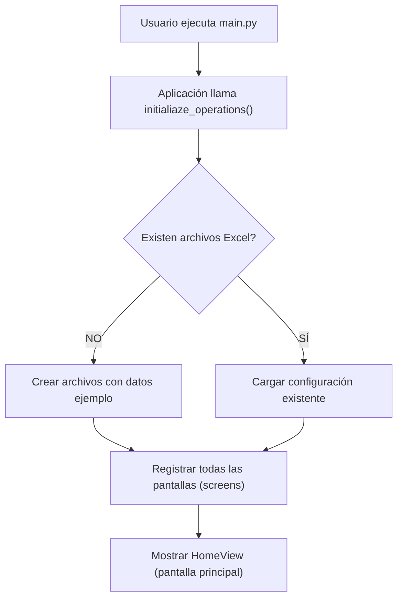
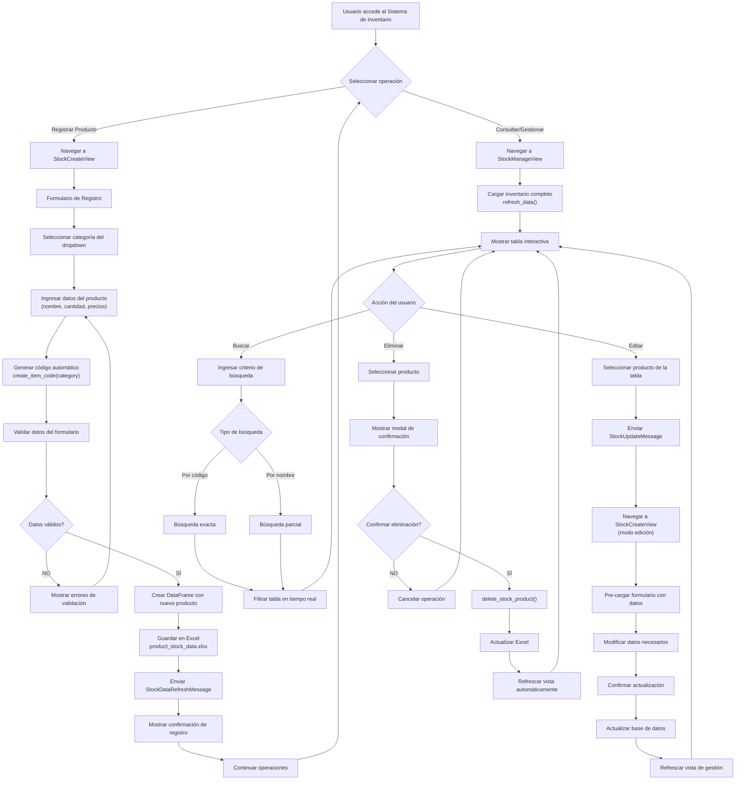
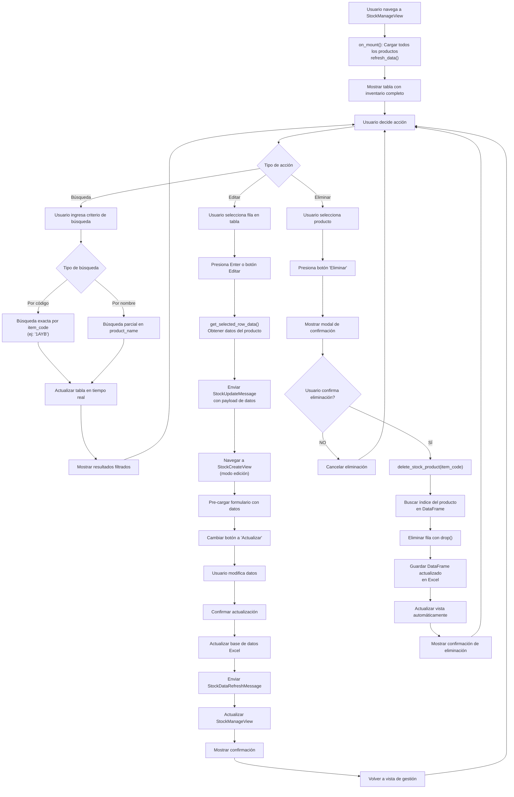
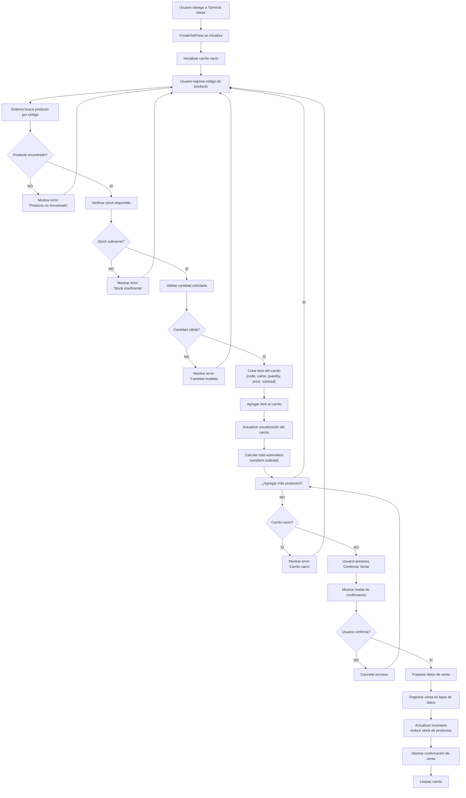
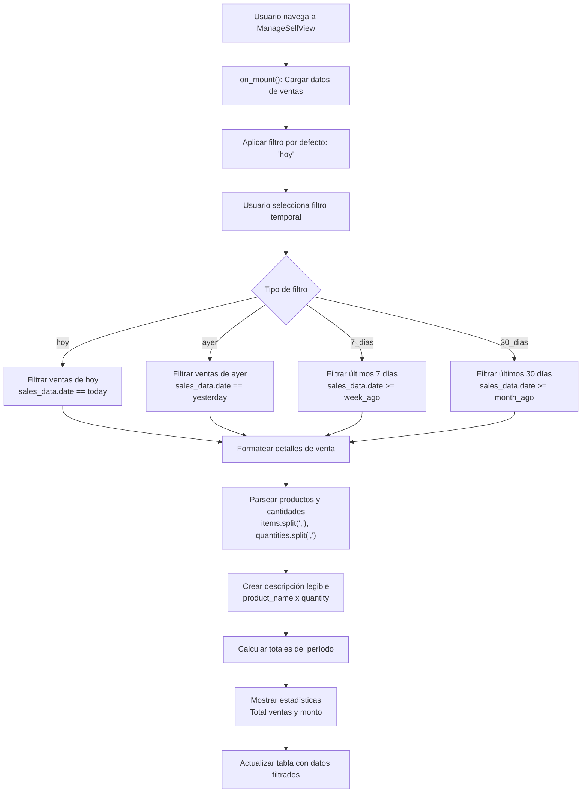
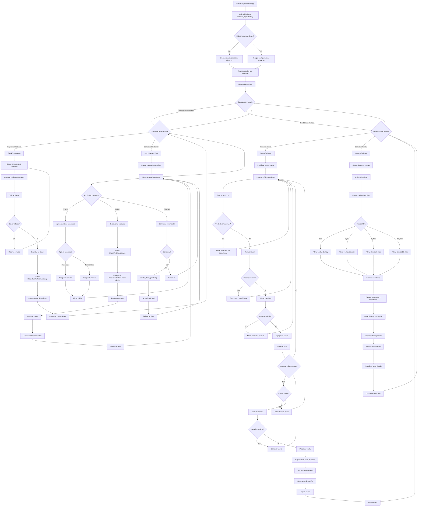

# Flujos de Trabajo del Sistema

## Visión General

Este documento describe los flujos de trabajo principales del sistema Mi Tiendita Soft, detallando paso a paso cómo se ejecutan las operaciones críticas del negocio.

## 1. Inicialización del Sistema

### Flujo de Arranque



### Inicialización de Base de Datos

**Ubicación:** `src/business/create_stock_controller.py:initialiaze_operations()`

1. **Verificación de archivos**

   ```python
   if os.path.exists(STOCK_FILE_PATH):
       return "La base de datos ya ha sido creada"
   ```

2. **Creación de datos iniciales** (si no existen)

   - **Productos ejemplo:** 4 productos en categoría "Alimentos y bebidas"
   - **Categorías:** 7 categorías predefinidas del sistema
   - **Ventas:** Archivo vacío listo para registros

3. **Archivos creados:**
   - `product_stock_data.xlsx`: Inventario con productos ejemplo
   - `category_data.xlsx`: Categorías del sistema
   - `sell_data.xlsx`: Base de datos de ventas (vacía)

## 2. Gestión de Inventario



### 2.1 Registro de Nuevo Producto

**Vista:** `StockCreateView`
**Controlador:** `create_stock_controller.py`

#### Flujo Paso a Paso

1. **Navegación**

   ```
   HomeView → Botón "Registro de Inventario" → StockCreateView
   ```

2. **Formulario de Registro**

   - Usuario selecciona categoría del dropdown
   - Ingresa nombre del producto
   - Especifica cantidad inicial
   - Define precio de compra y venta

3. **Generación Automática de Código**

   ```python
   def create_item_code(category_name: str):
       # Extrae iniciales: "Alimentos y Bebidas" → "AYB"
       item_letters = "".join([word[0] for word in category_name.split()]).upper()

       # Busca último consecutivo de la categoría
       filtered_data = search_data_by_field(STOCK_FILE_PATH, SHEET_NAME, "category", category_name)

       if not filtered_data.empty:
           last_code = filtered_data["item_code"].iloc[-1]
           consecutive_num = re.findall(r"\d+", last_code)[0]
           new_consecutive = int(consecutive_num) + 1
           return f"{new_consecutive}{item_letters}"
       else:
           return f"1{item_letters}"
   ```

4. **Validación de Datos**

   - Precios deben ser positivos
   - Cantidad debe ser válida
   - Nombre no puede estar vacío
   - Categoría debe existir

5. **Persistencia**

   ```python
   def create_stock_product(data):
       # Crear DataFrame con nuevo producto
       df_new_product = pd.DataFrame(data)

       # Leer datos actuales
       df_current_stock_data = read_excel_data(STOCK_FILE_PATH, SHEET_NAME, "")

       # Combinar datos
       df_combined_data = pd.concat([df_current_stock_data, df_new_product])

       # Guardar en Excel
       df_combined_data.to_excel(STOCK_FILE_PATH, sheet_name=SHEET_NAME, index=False)
   ```

6. **Notificación**
   - Envía `StockDataRefreshMessage`
   - Actualiza automáticamente `StockManageView` si está abierta
   - Muestra confirmación al usuario

#### Ejemplo de Generación de Códigos

| Categoría           | Primera vez | Segunda vez | Tercera vez |
| ------------------- | ----------- | ----------- | ----------- |
| Alimentos y bebidas | 1AYB        | 2AYB        | 3AYB        |
| Aseo personal       | 1AP         | 2AP         | 3AP         |
| Dulcería            | 1D          | 2D          | 3D          |

### 2.2 Consulta y Gestión de Inventario

**Vista:** `StockManageView`



**Detalles de implementación:**

#### Flujo de Consulta

1. **Carga Inicial**

   ```python
   def on_mount(self):
       self.refresh_data()  # Carga todos los productos
   ```

2. **Búsqueda**

   - **Por código:** Ingresa código exacto (ej: "1AYB")
   - **Por nombre:** Búsqueda parcial en nombre del producto
   - **Resultado inmediato:** Se actualiza tabla en tiempo real

3. **Visualización**
   - Tabla interactiva con DataTable de Textual
   - Columnas: Código, Categoría, Nombre, Cantidad, Precios
   - Navegación con teclado (flechas, Tab, Enter)

#### Comunicación Entre Vistas

```python
def on_data_table_row_selected(self, event):
    # Obtiene datos del producto seleccionado
    row_data = self.get_selected_row_data()

    # Envía mensaje con datos para edición
    self.post_message(StockUpdateMessage(payload=row_data))
```

#### Eliminación de Productos

```python
def delete_stock_product(item_code: str):
    df_current_stock_data = read_excel_data(STOCK_FILE_PATH, SHEET_NAME, "")
    item_index = df_current_stock_data[df_current_stock_data["item_code"] == item_code].index
    deleted_db = df_current_stock_data.drop(item_index)
    deleted_db.to_excel(STOCK_FILE_PATH, sheet_name=SHEET_NAME, index=False)
```

## 3. Gestión de Ventas

### 3.1 Proceso de Venta

**Vista:** `CreateSellView`
**Controlador:** `sell_controller.py`

#### Flujo Completo de Venta



**Detalles de implementación:**

1. **Validación de Producto**

   ```python
   # Buscar producto por código
   product_data = search_stock("item_code", product_code)

   if product_data.empty:
       show_error("Producto no encontrado")
       return

   # Verificar stock disponible
   available_stock = product_data.iloc[0]["quantity"]
   if requested_quantity > available_stock:
       show_error(f"Stock insuficiente. Disponible: {available_stock}")
       return
   ```

2. **Agregado al Carrito**

   ```python
   cart_item = {
       "code": product_code,
       "name": product_name,
       "quantity": requested_quantity,
       "unit_price": sale_price,
       "subtotal": sale_price * requested_quantity
   }

   self.cart_items.append(cart_item)
   self.update_cart_display()
   self.calculate_total()
   ```

3. **Cálculo Automático**

   ```python
   def calculate_total(self):
       total = sum(item["subtotal"] for item in self.cart_items)
       self.total_label.update(f"Total: ${total:,}")
   ```

4. **Procesamiento Final**

   ```python
   def process_sale(self):
       # Preparar datos de venta
       sale_data = {
           "items": ",".join([item["code"] for item in self.cart_items]),
           "quantities": ",".join([str(item["quantity"]) for item in self.cart_items]),
           "total": self.total_amount
       }

       # Registrar venta
       sell_controller.create_sell([sale_data])

       # Actualizar inventario
       for item in self.cart_items:
           update_stock_after_sale(item["code"], item["quantity"])
   ```

#### Validaciones Durante la Venta

- **Producto existe:** Verificación en base de datos
- **Stock suficiente:** Cantidad solicitada ≤ stock disponible
- **Cantidades válidas:** Números positivos y enteros
- **Carrito no vacío:** Mínimo un producto para procesar

### 3.2 Consulta de Ventas

**Vista:** `ManageSellView`

#### Flujo de Consulta



**Detalles de implementación:**

1. **Carga Inicial**

   ```python
   def on_mount(self):
       self.load_sales_data()
       self.apply_filter("hoy")  # Filtro por defecto
   ```

2. **Filtros Temporales**

   ```python
   def apply_date_filter(self, filter_type: str):
       today = datetime.now().date()

       if filter_type == "hoy":
           filtered_sales = sales_data[sales_data["date"].dt.date == today]
       elif filter_type == "ayer":
           yesterday = today - timedelta(days=1)
           filtered_sales = sales_data[sales_data["date"].dt.date == yesterday]
       elif filter_type == "7_dias":
           week_ago = today - timedelta(days=7)
           filtered_sales = sales_data[sales_data["date"].dt.date >= week_ago]
       elif filter_type == "30_dias":
           month_ago = today - timedelta(days=30)
           filtered_sales = sales_data[sales_data["date"].dt.date >= month_ago]
   ```

3. **Visualización Detallada**

   ```python
   def format_sale_details(self, sale_row):
       # Parsear productos vendidos
       items = sale_row["items"].split(",")
       quantities = sale_row["quantities"].split(",")

       # Crear descripción legible
       details = []
       for item_code, qty in zip(items, quantities):
           product_name = self.get_product_name(item_code)
           details.append(f"{product_name} x{qty}")

       return " | ".join(details)
   ```

4. **Cálculo de Totales**

   ```python
   def calculate_period_totals(self, filtered_sales):
       total_sales = len(filtered_sales)
       total_amount = filtered_sales["total"].sum()

       self.stats_label.update(
           f"Ventas: {total_sales} | Total: ${total_amount:,}"
       )
   ```

## 4. Comunicación Entre Componentes

### Sistema de Mensajes

**Arquitectura:** Observer Pattern usando mensajes de Textual

#### Mensajes Disponibles

```python
class StockUpdateMessage(Message):
    """Notifica que se debe editar un producto específico"""
    def __init__(self, payload: dict) -> None:
        self.payload = payload  # Datos del producto a editar
        super().__init__()

class StockDataRefreshMessage(Message):
    """Solicita actualización de datos de inventario"""
    pass
```

#### Flujo de Comunicación

1. **Envío de Mensaje**

   ```python
   # Desde StockManageView
   self.post_message(StockUpdateMessage(payload=product_data))
   ```

2. **Recepción en Aplicación Principal**

   ```python
   # En MiTienditaApp
   def on_stock_update_message(self, message: StockUpdateMessage) -> None:
       stock_screen = self.get_screen("stock_register_view")
       if hasattr(stock_screen, "set_edit_data"):
           stock_screen.set_edit_data(message.payload)
       self.push_screen("stock_register_view")
   ```

3. **Procesamiento en Vista Destino**
   ```python
   # En StockCreateView
   def set_edit_data(self, data: dict):
       self.edit_mode = True
       self.category_select.value = data["category"]
       self.name_input.value = data["product_name"]
       # ... llenar otros campos
   ```

## 5. Manejo de Errores y Validaciones

### Validaciones en Tiempo Real

#### Formulario de Productos

```python
def validate_price_input(self, value: str) -> bool:
    try:
        price = float(value)
        return price > 0
    except ValueError:
        return False

def on_input_changed(self, event):
    if not self.validate_price_input(event.value):
        self.show_validation_error("El precio debe ser un número positivo")
```

#### Proceso de Venta

```python
def validate_sale_item(self, product_code: str, quantity: int) -> tuple[bool, str]:
    # Verificar que el producto existe
    product = search_stock("item_code", product_code)
    if product.empty:
        return False, "Producto no encontrado"

    # Verificar stock disponible
    available = product.iloc[0]["quantity"]
    if quantity > available:
        return False, f"Stock insuficiente. Disponible: {available}"

    return True, "OK"
```

### Manejo de Excepciones

```python
def safe_excel_operation(operation_func, *args, **kwargs):
    try:
        return operation_func(*args, **kwargs)
    except FileNotFoundError:
        logger.error("Archivo de base de datos no encontrado")
        return None
    except PermissionError:
        logger.error("Sin permisos para acceder al archivo")
        return None
    except Exception as e:
        logger.error(f"Error inesperado: {e}")
        return None
```

## 6. Diagrama de flujo de toda la aplicación


